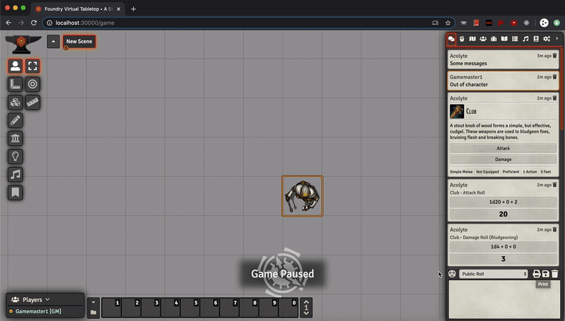
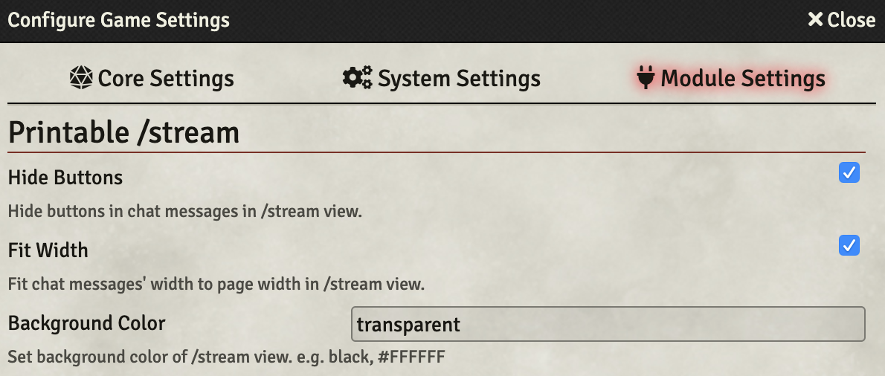

# Printable /stream

A Foundry Virtual Tabletop Module that makes /stream view suitable for the web browser's print page function.

## How to use

1. Install and activate this module.
2. Go to the \<your-hostname>/stream page or just click the **Print** button, which is right above the chat textinput box.
3. Print the /stream view page with your web browser's print function.

## Features

* Convert chat messages' metadata which says "\<time\> ago" into chat messages' actual timestamp on /stream page
* Hide delete chat message buttons(trash bin icon) from chat messages in print mode
* Has some configurable options

